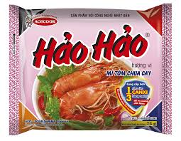
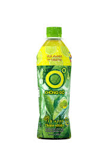

**\[PYTHON\] Supermarket Checkout**

**🛒 Introduce**

This project is a **Smart Checkout System** that simulates an automated cashier counter using AI.  
By combining **YOLOv8 (object detection)**, **Flask (web interface)**, and **SQL Server (database)**, the system can:

- Detect real-world products through a webcam in real time.
- Automatically count product quantity and calculate the total price.
- Display a live invoice on a web page for user checkout.

The system aims to **replace traditional barcode scanning** by recognizing products visually, making the checkout process faster and smarter. It's a practical demonstration of how **AI and computer vision** can be applied in **retail and self-service environments**.

**💡 TL;DR:**

A computer vision-powered self-checkout system — detect products → count → calculate total → display receipt on web.

**🧱 Architecture Summary**

| **Component** | **Description** |
| --- | --- |
| **YOLOv8** | Deep learning model used for object detection. Trained specifically on supermarket products for accurate recognition. |
| **Flask Web Server** | Hosts a real-time web interface to display invoices (/checkout). |
| **Camera (OpenCV)** | Captures live video stream using cv2.VideoCapture(). |
| **SQL Server** | Stores product data in the SANPHAM table (Names, Price). |
| **Threading** | Runs Flask and the camera simultaneously using Python's threading.Thread. |

**⚙️ Description of Operation**

**🔄 Simultaneous Execution:**

- **Thread 1 – Flask**:  
    Launches a web server that serves the live invoice at:  
    👉 <http://127.0.0.1:5000/checkout>
- **Thread 2 – Camera Detection**:  
    Opens the webcam and continuously detects products using YOLOv8.

**📦 Product Detection Flow:**

1. The camera detects products in real-time.
2. For each newly detected product (compared to the previous frame):
    - The system **queries product info** from the SANPHAM table by product_name.
    - Updates the internal products_detected dictionary:

python

Sao chépChỉnh sửa

products_detected = {

'CocaCola': {'price': 10000, 'quantity': 2},

...

}

- - Calculates:
        - Total_quantity += newly_detected_quantity
        - Total_price += price \* quantity

1. **Visual feedback**:
    - Bounding boxes and product names are drawn on the camera frame.
    - The web invoice (/checkout) updates live with current product list and total cost.

**DataSet:**

| Class | Image | mAP50 |
| --- | --- | --- |
| clear men |  | 0.995 |
| cocacola |  | 0.877 |
| mi hao hao |  | 0.995 |
| sua milo |  | 0.66 |
| tra xanh khong do |  | 0.699 |
| tuong ot chinsu |  | 0.995 |

**Experiments:**

For each class, I take the first 100 images, and then split them to training ,test sets and valid set with ratio 6/2/2. The training/test/valid loss/accuracy curves for the experiment are shown below:

